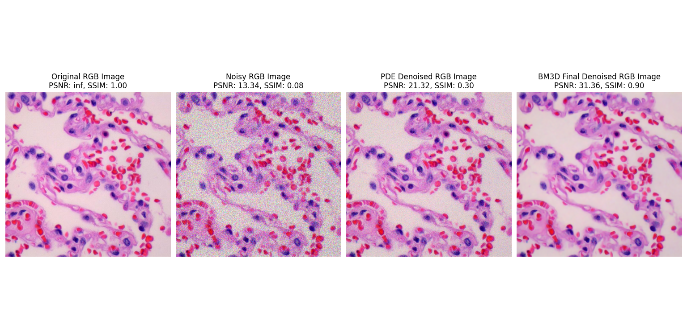
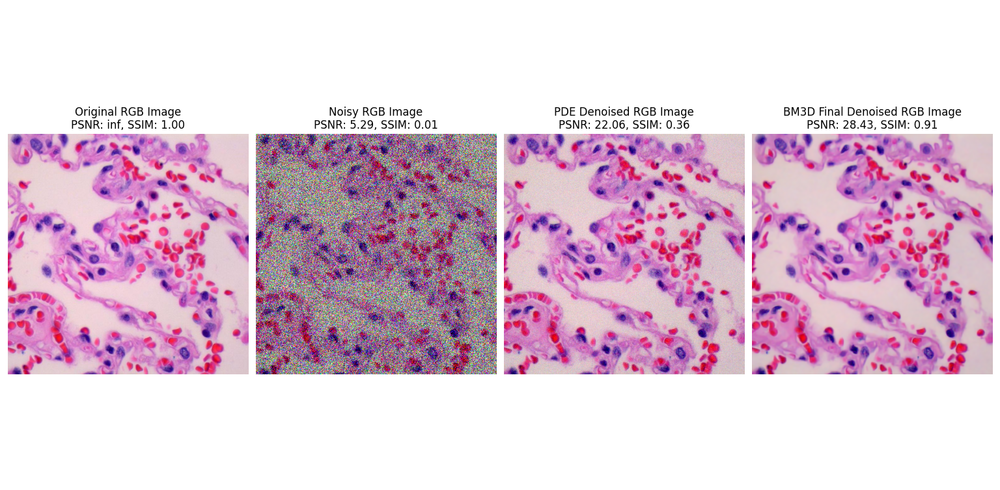
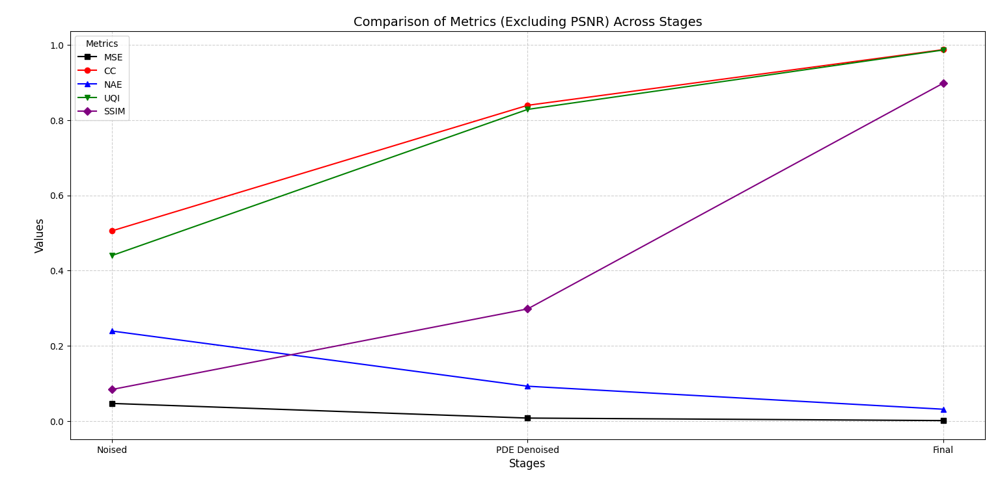

# ACO-RFPDE Biopsy Image Denoising

A novel framework for denoising Poisson-corrupted microscopic biopsy images using **Ant Colony Optimization** and **Fourth-Order Partial Differential Equations**.

## Overview

Removes Poisson noise from lung cancer biopsy images while preserving diagnostic features. Combines ACO optimization with PDE-based filtering and BM3D enhancement.

**Key Features:**
- Poisson noise removal with edge preservation
- Automated parameter tuning via ACO
- 95%+ accuracy across noise levels 1-8
- Works on lung and colon cancer biopsies

## 🚀 Installation Prerequisites :
- Python 3.7+
- NumPy
- SciPy
- OpenCV
- Matplotlib
- scikit-image
## Quick Usage

```python
from aco_rfpde import BiopsyDenoiser
import cv2

# Load and denoise image
denoiser = BiopsyDenoiser()
noisy_image = cv2.imread('noisy_biopsy.jpg')
denoised = denoiser.denoise(noisy_image, noise_level=4)
enhanced = denoiser.enhance_bm3d(denoised)

cv2.imwrite('result.jpg', enhanced)
```

## Results

### Visual Results

#### Benign Lung Tissues




### Performance Metrics

#### Benign Lung Tissues
| Noise Level | Stage | PSNR | SSIM | MSE | NAE | CC | UQI |
|-------------|-------|------|------|-----|-----|----|----|
| 4 | Noisy | 13.348 | 0.084 | 0.046 | 0.239 | 0.506 | 0.440 |
| 4 | PDE Denoised | 21.534 | 0.306 | 0.007 | 0.090 | 0.847 | 0.837 |
| 4 | **BM3D Enhanced** | **31.527** | **0.901** | **0.001** | **0.030** | **0.988** | **0.987** |
| 6 | Noisy | 5.296 | 0.014 | 0.296 | 0.630 | 0.166 | 0.092 |
| 6 | PDE Denoised | 21.508 | 0.334 | 0.007 | 0.097 | 0.869 | 0.859 |
| 6 | **BM3D Enhanced** | **27.922** | **0.905** | **0.002** | **0.049** | **0.989** | **0.988** |

#### Lung Adenocarcinomas
| Noise Level | Stage | PSNR | SSIM | MSE | NAE | CC | UQI |
|-------------|-------|------|------|-----|-----|----|----|
| 4 | Noisy | 13.387 | 0.094 | 0.046 | 0.287 | 0.439 | 0.355 |
| 4 | PDE Denoised | 21.862 | 0.365 | 0.007 | 0.107 | 0.799 | 0.779 |
| 4 | **BM3D Enhanced** | **31.764** | **0.859** | **0.001** | **0.034** | **0.975** | **0.972** |
| 6 | Noisy | 5.663 | 0.016 | 0.274 | 0.782 | 0.145 | 0.070 |
| 6 | PDE Denoised | 22.146 | 0.403 | 0.006 | 0.119 | 0.832 | 0.816 |
| 6 | **BM3D Enhanced** | **29.077** | **0.865** | **0.001** | **0.049** | **0.977** | **0.976** |

#### Lung Squamous Cell Carcinomas
| Noise Level | Stage | PSNR | SSIM | MSE | NAE | CC | UQI |
|-------------|-------|------|------|-----|-----|----|----|
| 4 | Noisy | 13.444 | 0.062 | 0.045 | 0.299 | 0.397 | 0.302 |
| 4 | PDE Denoised | 21.710 | 0.271 | 0.006 | 0.115 | 0.755 | 0.726 |
| 4 | **BM3D Enhanced** | **32.926** | **0.874** | **0.001** | **0.031** | **0.977** | **0.974** |
| 6 | Noisy | 5.742 | 0.010 | 0.269 | 0.820 | 0.129 | 0.055 |
| 6 | PDE Denoised | 21.185 | 0.270 | 0.008 | 0.146 | 0.765 | 0.735 |
| 6 | **BM3D Enhanced** | **28.773** | **0.871** | **0.001** | **0.055** | **0.978** | **0.975** |

### Performance Graphs


*Line plots showing PSNR, SSIM, MSE, NAE, CC, and UQI improvements across processing stages*

### Key Metrics Explanation
- **PSNR**: Peak Signal-to-Noise Ratio (higher = better)
- **SSIM**: Structural Similarity Index (closer to 1 = better) 
- **MSE**: Mean Squared Error (lower = better)
- **NAE**: Normalized Absolute Error (lower = better)
- **CC**: Correlation Coefficient (closer to 1 = better)
- **UQI**: Universal Quality Index (closer to 1 = better)

## Dataset

Uses **LC25000** dataset with lung and colon cancer histopathological images.

## Citation

```bibtex
@article{elsayed2024denoising,
  title={Denoising Of Poisson-Corrupted Biopsy Images},
  author={ElSayed, Ahmed Loay and Mohsen, Lyan Ahmed and Mohamed, Sarah Sameh and Mohamed, Mariam Sherif and Hanafy, Alhussien Ayman},
  journal={Cairo University},
  year={2024}
}
```

## Authors

**Cairo University - Biomedical Engineering Department**
- Ahmed Loay ElSayed
- Lyan Ahmed Mohsen  
- Sarah Sameh Mohamed
- Mariam Sherif Mohamed
- Alhussien Ayman Hanafy
